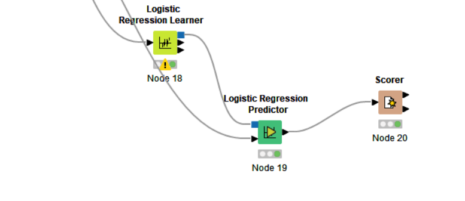
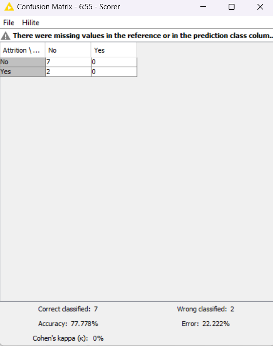
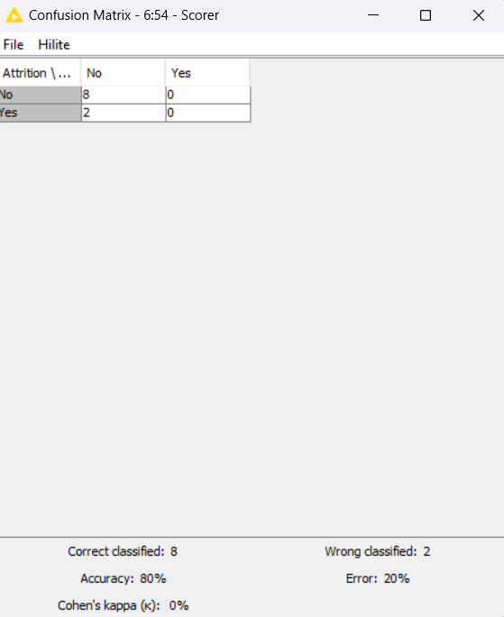
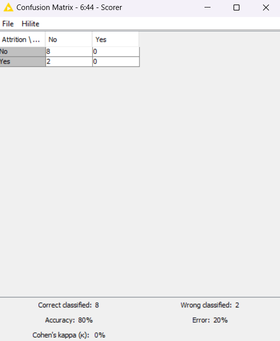
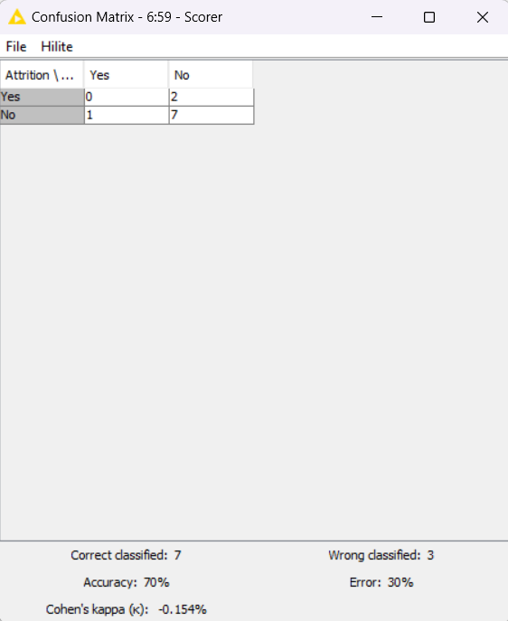
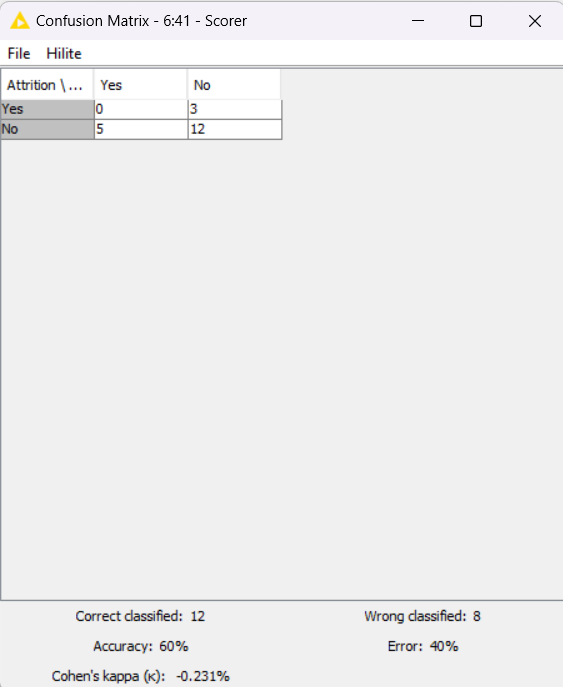
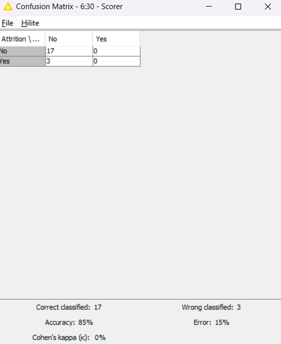
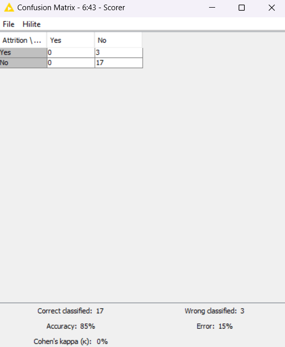
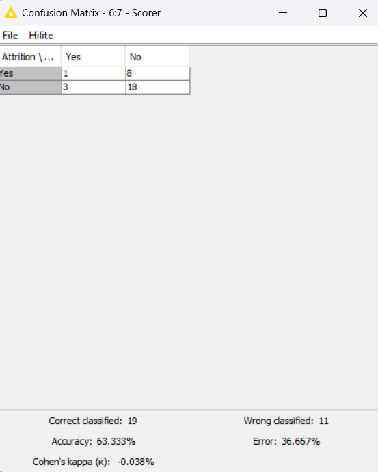
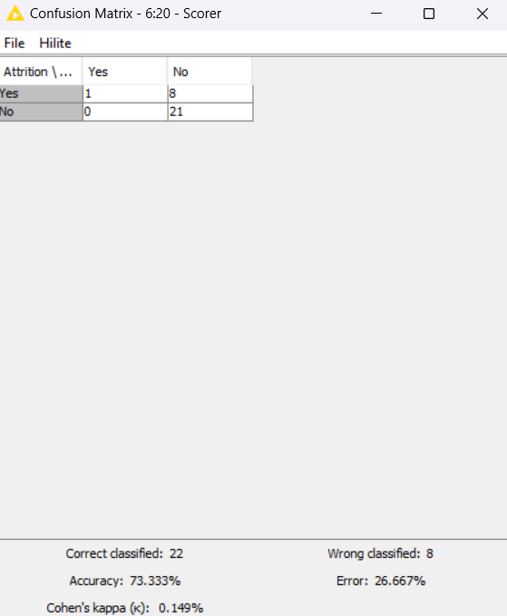

# codeless-ai-ml-2022
# Introduction
Employee Attrition is when an employee leaves the company through any method, including voluntary resignations, layoffs, failure return from leave of absence, or even illness or death. Every year a lot of companies hire a number of emplyoyees. The companues invest time and money in trining those employees, not just this but there are training programs within the companies for thire existing employees as well.

# Research Idea
1.Use data to predict employee attrtion.
2.Use data to let companies know their weaknesses from an employee's point of view. in order to make adjustments and may reduce the number of employees who will resign Or it can make employees happier and improving the performance of employees.

# Overview of the Study
Our studying concerns the gender , satisfaction level of employee with work environment and company , frequency of business travel, department, salary bracket of employee and distance from home to office.
The specific objective of this Study was to investigate the advertising strategy employed by company to which group of people they must advertise more. Our goal was to compare purchasing of the product by person based on sex , age and estimated salary.
Our data focuses on internal reasons for employees leaving only. There may be external reasons or personal reasons for employees to resign, such as health, family conditions, death, etc.

# Tool
knime

# Nodes being used in KNIME
CSV Reader
Column Filter 
Partitioning
Decision Tree Learner
Decision Tree Predictor
Logistic Regression Learner
Logistic Regression Predictor
Naive Bayes Learner 
Naive Bayes Predictor
Random Forest Learner
Random Forest Predictor
Scorer 

# Model
*1. Data access and preparation/*

  

using CSV Reader node for access data.
In part of data preparation I use Column filter to remove columns that I don't need or are not important for use
and use Partitioning to divide information, The first is for the ML to learn and the other is for the ML to test, 
I divided into 90:10 , 80:20 , 70:30 to try to compare which one is the best.

*2.classification model (Decision Tree model)/*

  

using Decision Tree Learner node and Decision Tree Predictor node.

*3.classification model (Naive Bayes model)/*

  

using Naive Bayes Learner node and Naive Bayes Predictor node.

*4.classification model (Random Forest model)/*

  

using Random Forest Learner node and Random Forest Predictor node.

*5.classification model (Logistic Regression model)/*

  

using Logistic Regression Learner node and Logistic Regression Predictor node.

*6.score of each classification model (Partitioning 90:10)/*
-Decision Tree model

  

-Naive Bayes model

  

-Random Forest model

  

-Logistic Regression model

  

*7.score of each classification model (Partitioning 80:20)/*
-Decision Tree model

  

-Naive Bayes model

  

-Random Forest model

  

-Logistic Regression model

  

*8.score of each classification model (Partitioning 70:30)/*
-Decision Tree model

  

-Naive Bayes model

  

-Random Forest model

  

-Logistic Regression model

  

# Conclusion
In summary, using the naive bayes model and the logistic modal gives the best accuracy with a score of 85:15 in an 80:10 split, both of model fit this data best.

  

  

